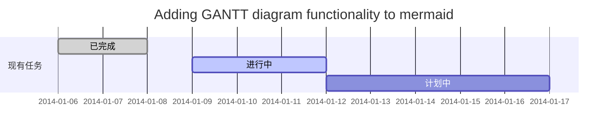
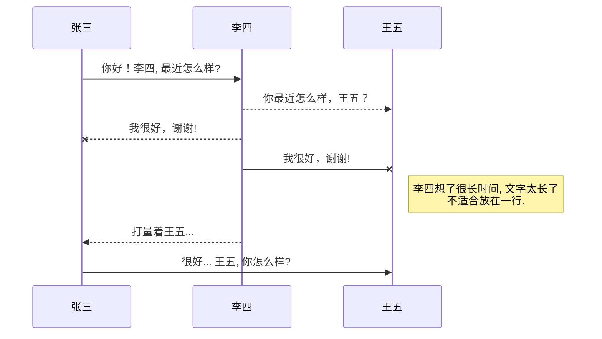
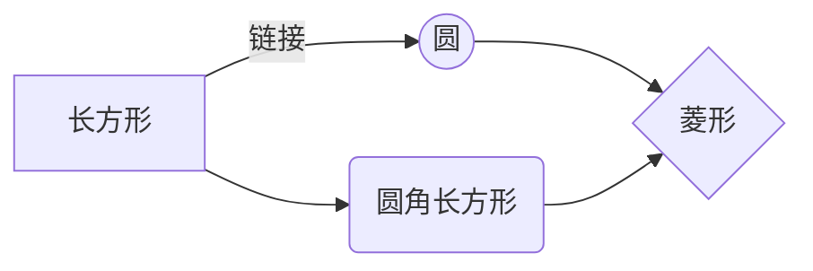

[TOC]

标题
===
```
一级标题
====

二级标题
----
##二级标题 


####小标题
  最多只有6个级别
```

粗斜体
===
```
*斜体文本*  _斜体文本_
**粗体文本**  __粗体文本__
***粗斜体文本***  ___粗斜体文本___
~~删除文本~~
* 和 _ 一样的作用，依照个数进行不同的选择操作
```

链接
===
```
网址链接 [链接名称](http://链接网址)
```

引用
===
```
> 引用的话
可以换行继续操作，换行默认会自动在开头添加 > 
只要中间没有中断那么引用也不会断
```

制表
===
```
| 该列表头 | 该列表头 | 该列表头 |
|:------------- |:---------------:| -------------:|
| 表内容 | 表内容 | 表内容 |
| 表内容 | 表内容 | 表内容 <br> 换行内容|
| 表内容 | 表内容 | ```代码内容``` |

| Column 1 | Column 2      | Column 3      |
|:------------- |:--------:| -------------:|
| centered 文本居左 | centered 文本居中 | right-aligned 文本居右 |
```

分隔符
===
```
 ---
在文本中需要分隔符的地方输入即可
```

符号转义
===

如果你的描述中需要用到 markdown 的符号，比如 _ # * 等，但又不想它被转义，这时候可以在这些符号前加反斜杠，如 \_ \# \* 进行避免。


列表
===
- 项目
  * 项目
    + 项目

1. 项目1
2. 项目2
3. 项目3

- [ ] 计划任务

- [x] 完成任务


链接
===

```
链接: [link](https://mp.csdn.net).

图片: 

带尺寸的图片: 

居中的图片: 

居中并且带尺寸的图片: 

```

注脚
===

```
一个具有注脚的文本。[^1]
随后换行写上 [^1]: 注脚的解释
```

字体颜色
===
```
<font color=颜色>内容</font>
```
<font color=grey>灰色</font>
<font color=red>红色</font>
<font color=blue>蓝色</font>

注释
===

```
Markdown将文本转换为 HTML。

*[HTML]:   超文本标记语言
```


LaTeX 数学公式
===

```
Gamma公式展示 $\Gamma(n) = (n-1)!\quad\forall
n\in\mathbb N$ 是通过 Euler integral

$$
\Gamma(z) = \int_0^\infty t^{z-1}e^{-t}dt\,.
$$
```

插入甘特图
===



插入UML图
===


插入Mermaid流程图
===


插入Flowchart流程图
===
```flow
st=>start: 开始
e=>end: 结束
test=>condition: 测试
op=>operation: 我的操作
cond=>condition: 确认？

st->op->cond->test
cond(yes)->test
cond(no)->op
```


# 数学

## 特殊字符

$$
\begin{array}{|c|c|c|c|c|c|c|c|}
\hline
{\alpha} & {\backslash alpha} & {\theta} & {\backslash theta} & {o} & {o} & {\upsilon} & {\backslash upsilon} \\\\
\hline
{\beta} & {\backslash beta} & {\vartheta} & {\backslash vartheta} & {\pi} & {\backslash pi} & {\phi} & {\backslash phi} \\\\
\hline
{\gamma} & {\backslash gamma} & {\iota} & {\backslash iota} & {\varpi} & {\backslash varpi} & {\varphi} & {\backslash varphi} \\\\
\hline
{\delta} & {\backslash delta} & {\kappa} & {\backslash kappa} & {\rho} & {\backslash rho} & {\chi} & {\backslash chi} \\\\
\hline
{\epsilon} & {\backslash epsilon} & {\lambda} & {\backslash lambda} & {\varrho} & {\backslash varrho} & {\psi} & {\backslash psi} \\\\
\hline
{\varepsilon} & {\backslash varepsilon} & {\mu} & {\backslash mu} & {\sigma} & {\backslash sigma} & {\omega} & {\backslash omega} \\\\
\hline
{\zeta} & {\backslash zeta} & {\nu} & {\backslash nu} & {\varsigma} & {\backslash varsigma} & {} & {} \\\\
\hline
{\eta} & {\backslash eta} & {\xi} & {\backslash xi} & {\tau} & {\backslash tau} & {} & {} \\\\
\hline
{\Gamma} & {\backslash Gamma} & {\Lambda} & {\backslash Lambda} & {\Sigma} & {\backslash Sigma} & {\Psi} & {\backslash Psi} \\\\
\hline
{\Delta} & {\backslash Delta} & {\Xi} & {\backslash Xi} & {\Upsilon} & {\backslash Upsilon} & {\Omega} & {\backslash Omega} \\\\
\hline
{\Omega} & {\backslash Omega} & {\Pi} & {\backslash Pi} & {\Phi} & {\backslash Phi} & {} & {} \\\\
\hline
\end{array}
$$

$$\delta$$ $$\Delta$$ $$\eta$$ $$\xi$$ $$\Lambda$$  $$\Sigma$$ $$\varepsilon$$ $$\mu$$ $$\vec{a}$$ $$\sum_{i=0}^n$$ $$\prod_{i=0}^n$$ $$\circ$$ 

$$\alpha$$ $$\theta$$ $$o$$ $$\upsilon$$ $$\infty$$ $$\cup$$ $$\cap$$ $$\forall$$  $\pm $ $\to$ $\Rightarrow$ $\iff$ 

$$\beta$$ $$\vartheta$$ $$\pi$$ $$\phi$$ $\lim_{n\rightarrow+\infty}\frac{1}{n(n+1)}$ 

$$\gamma$$ $$\iota$$ $$\varpi$$ $$\varphi$$ $\forall$ $\exists$ $\neq$ $\leq$ $\geq$ 

$$\delta$$ $$\kappa$$ $$\rho$$ $$\chi$$ $\sim$ $\times$ $$\cdot$$ $\in$ $\notin$ $\subset$ $\subseteq$ $\bigcup$ $\bigcap$ $\emptyset$ $\not\subset$ 

$$\epsilon$$ $$\lambda$$ $$\varrho$$ $$\psi$$ 

$$\varepsilon$$ $$\mu$$ $$\sigma$$ $$\omega$$ 

$$\zeta$$ $$\nu$$ $$\varsigma$$

$$\eta$$ $$\xi$$ $$\tau$$ 

$$\Gamma$$ $$\Lambda$$  $$\Sigma$$  $$\Psi$$

$$\Delta$$ $$\partial$$ $$\Xi$$ $$\Upsilon$$ $$\Omega$$

$$\Omega$$ $$\Pi$$  $$\Phi$$ 


## 公式

$$
公式： \\
\mathbf{X} =
\left( \begin{array}{ccc}
x\_{11} & x\_{12} & \ldots \\\\
x\_{21} & x\_{22} & \ldots \\\\
\vdots & \vdots & \ddots
\end{array} \right)
$$

## 矩阵

$$\begin{matrix}1 & 2\\\\3 &4\end{matrix}$$

$$\begin{pmatrix}1 & 2\\\\3 &4\end{pmatrix}$$

$$\begin{bmatrix}1 & 2\\\\3 &4\end{bmatrix}$$

$$\begin{Bmatrix}1 & 2\\\\3 &4\end{Bmatrix}$$

$$\begin{vmatrix}1 & 2\\\\3 &4\end{vmatrix}$$

$$\left|\begin{matrix}1 & 2\\\\3 &4\end{matrix}\right|$$

$$\begin{Vmatrix}1 & 2\\\\3 &4\end{Vmatrix}$$

## 积分

$$\int_a^b f(x)\mathrm{d}x$$

$$\int_a^b f(x)\,\mathrm{d}x$$


## 根式

$$\sqrt{2}<\sqrt[3]{3}$$

$$\sqrt{1+\sqrt[p]{1+a^2}}$$

$$\sqrt{1+\sqrt[^p\!]{1+a^2}}$$

## 分式

$$\frac{x+y}{2}$$

$$\frac{1}{1+\frac{1}{2}}$$

